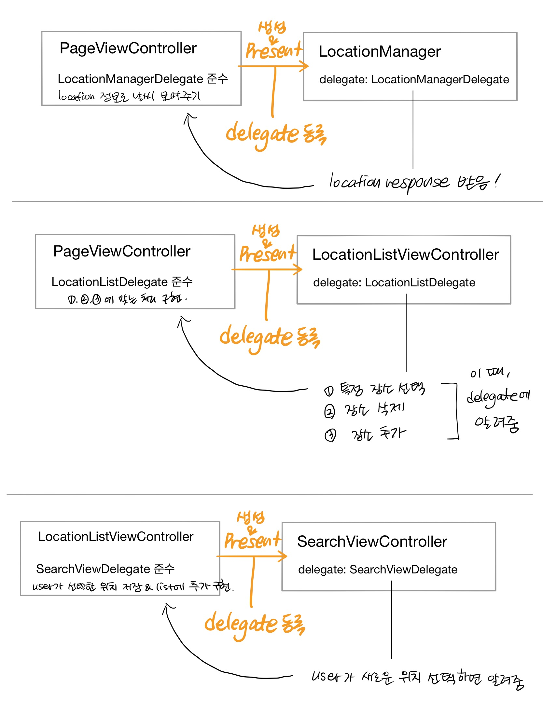

# WeatherApp

> 날씨 OpenAPI를 이용해서 Apple 기본 날씨앱 또는 Yahoo 날씨앱과 유사한 기능셋을 구현하기

&nbsp;

### Index

- [기능](#기능)
- [설계 및 구현](#설계-및-구현)
- [trouble shooting](#trouble-shooting)
- [학습한 내용](#관련-학습-내용)

---

<p float="left">
  
   
  
</p>

 &nbsp;

---

## 기능

- [날씨 정보](#날씨-정보)
- [장소 저장 리스트](#장소-저장-리스트)
- [장소 검색 및 추가](#장소-검색-및-추가)
- [온도 단위 설정](#온도-단위-설정)
- [사용자 설정 저장](#사용자-설정-저장)

### 날씨 정보

위치 리스트(현재 위치 + 저장된 위치)의 날씨를 각각 가로 스크롤로 전환하여 조회 가능


### 장소 저장 및 리스트 조작

추가했던 장소 리스트를 볼 수 있고, 삭제할 수 있다


### 장소 검색 및 추가

원하는 장소를 검색하여 추가하고, 관련 날씨 정보를 볼 수 있다


### 온도 단위 설정

온도 단위를 **섭씨 혹은 화씨**로 변환하여 볼 수 있다


### 사용자 설정 저장

다음 설정을 저장하여 앱을 다시 실행시, 기존의 설정대로 실행되도록 한다

| 추가한 장소                 | 온도 단위 설정              | 마지막으로 본 페이지         |
| --------------------------- | --------------------------- | ---------------------------- |
|  |  |  |

&nbsp;

---

## 설계 및 구현

### View Controller 구성


&nbsp;

### 날씨 모델과 View - MVVM

#### WeatherViewController - WeatherViewModel


- ViewModel 의 view 관련 type 에 Observer 를 등록할 수 있는 타입을 구현
  - `Observable` protocol
  - ViewModel - CurrentWeather, HourlyWeatherItem, DailyWetherItem, DetailWeather 대상 data 변화에 대해 observer 를 등록할 수 있다
  - observer handler 에 관련 view 나 label text 를 변경할 수 있는 함수를 등록
  - view model 변경시에 해당 observer가 실행되어 view 도 같이 그에 맞게 업데이트 된다

&nbsp;

### 역할 분배

#### view 관련

| class / struct               | 역할                                                         |
| ---------------------------- | ------------------------------------------------------------ |
| `PageViewController`         | LocationManager 사용해서 받은 현재위치를 포함하여, 저장된 위치의 날씨를 보여줄 WeatherViewController 를 보여준다 |
| `WeatherViewController`      | Location 객체에 해당하는 위치 정보를 보여준다                |
| `WeatherViewModel`           | - OpenWeatherMapService 를 이용하여 위치에 맞는 날씨 정보를 가져온다<br />- WeatherBuilder 객체를 통해 가져온 정보를 view 에 필요한 데이터 타입들로 만든다 |
| `WeatherBuilder`             | 네트워킹을 통해 받아온 `WeatherData` 객체를 view model 의 각 필요에 맞게 가공한다 |
| `LocationListViewController` | - 저장된 위치를 사용자에게 보여준다 <br />- 저장된 위치를 삭제한다 <br />- 온도 단위를 바꾼다 <br />- SearchViewController 를 보여준다 |
| `SearchViewController`       | - 사용자 검색 문자열을 사용하여 위치 자동완성 <br />- 사용자가 선택한 위치 정보(장소이름, 위도, 경도) 를 LocationViewController delegate 통해 넘긴다 |
| `Observable`                 | - ViewModel 의 각 데이터 타입에 observer 기능을 구현하기 위한 generic type<br />- `WeatherViewModel` 에서 observer 등록이 필요한 속성에 사용됨 |


#### Utilities

| class / struct          | 역할                                                         |
| ----------------------- | ------------------------------------------------------------ |
| `LocationManager`       | CLLocationManager 사용하여 현재 위치 가져오기                |
| `OpenWeatherMapService` | - 네트워킹 통한 날씨 예측 정보 가져오기<br />- `WeatherData` 타입으로 json decoding 하기 |
| `WeatherBuilder`        | `WeatherData` → `WeatherViewModel` 이 가진 각 type으로 데이터 가공 |
| `WindDirection`         | 바람의 방향 값(360도 내)을 compass direction으로 변환        |
| `DateConverter`         | 주어진 timezone 을 사용하여 문자열로 된 날짜를 변환해 주는 역할 |

&nbsp;

### Weather Model Hierarchy


&nbsp;

### ViewController 간 Data 주고 받기 - Delegate 사용

[*관련 학습한 내용- 1*](#view-controller-양방향-데이터-전달)     [*관련 학습한 내용- 2*](https://daheenallwhite.github.io/ios/2019/07/22/Delegation/)

view controller 간 데이터를 backward 로 받기 위해서, delegate protocol 을 구현하여 사용




&nbsp;

### 현재 위치 - CLLocationManager 활용

> `LocationMagnager` class 로 구현

#### 위치 가져오는 과정

1. `CLLocationManager` 객체 생성
2. location 데이터의 정확도 설정 : `desiredAccuracy` property 설정
3. 사용자에게 위치정보 사용 허가 받기 : `requestWhenInUseAuthorization()` method 
4. 위치 요청이 가능한 허가 상태 `CLAuthorizationStatus` : `.authorizedWhenInUse` / `.authorizedAlways`
5. 위치 요청: `requestLocation()`
   - 해당 method는 즉각 return 한다
   - 위치 값을 얻은 후, delegate 의 `didUpdateLocation` method 를 호출한다
6. Delegate method - `didUpdateLocation` 

&nbsp;

### 날씨 정보 받아오기 & 파싱하기 - OpenWeather API / URLSession / Codable

>  [5 days / 3 hours forecast api](https://openweathermap.org/forecast5)

*API JSON 구조 (orange color : 배열 구조)*


- [URLSession 학습한 내용](#url-loading-system)
- Codable : `Data` → `WeatherData` 변환하기
  - `WeatherData` 는 `Codable` protocol 을 준수
  - `JSONDecoder` 사용하여 변환

&nbsp;

### 장소 검색 & 자동완성 - MKLocalSearchCompleter 

> 문자열로 위치를 제공하면 그에 맞는 자동완성된 comletion string list 를 제공하는 utility 객체

- 구현 원리 

  

- `results` property : `MKLocalSearchCompleter` 의 자동완성 처리된 데이터를 얻는 속성
  - `MKLocalSearchCompletion` type
  - 직접 생성할 수는 없다. Completer 에 의해서만 생성되는 객체
- completion 될 대상 지정 방법
  - 위치 문자열, 지역, 필터 타입 등을 지정할 수 있다.
  - 도시명 검색 : `queryFragment` property 에 사용자가 입력하는 문자열 설정
  - 필터 타입 : locationAndQueries / locationsOnly 
- delgate : search completion data 를 가져오기 위한 메소드가 정의됨
  - `MKLocalSearchCompleterDelegate`
  - `completerDidUpdateResults()` 메소드 : completer 가 검색 완성 배열을 업데이트 한 뒤 호출하는 메소드.
  - 이 메소드 안에 search 결과 table view 를 reload 하도록 구현함

&nbsp;

### 사용자 설정 저장 - UserDefaults

[*관련 학습한 내용*]()

사용자 설정 항목

- 마지막으로 본 날씨의 위치 
- 사용자가 저장한 위치 리스트
- 온도 단위 선택 정보

UserDefaults 에 사용될 key 관리하는 struct `DataKeys`

&nbsp;

### API 데이터 기반 시간 구하기

API 에서 받아온 date & time (UTC 표준)  → 각 나라별 시간으로 변환하기

1. `list.dt_text` string (utc 단위 시간) → `Date` 객체로 변환
2. `city.timezone` : 해당 도시의 시간을 UTC로부터 변환하기 위한 차이값. 단위는 초
3. 각 도시의 시간 = `list.dt_txt` 를 date로 변환한 객체 + `city.timezone`
4. 차이값 더해주기 : `Date` - `addingTimeInterval()` method 사용

&nbsp;

### 온도 단위 설정대로 정보 보여주기 - Singleton 활용

- Singleton 으로 구현한 이유
  - view controller 뿐만 아니라 날씨 관련된 거의 모든 data model 에서 온도와 관련된 부분이 많음
  - Singleton 통해서 하나의 인스턴스로 사용자가 설정한 온도 단위를 이용하는게 적절하다고 판단

- `TemperatureUnit` 의 `shared` property 로 단위 접근 가능

&nbsp;

---

## Trouble Shooting

### Page View Controller 에서 계속해서 WeatherViewController 를 생성하는 문제

- 문제상황  
  - PageViewController 에서 swipe 에 따른 이전/이후 페이지 요청시마다 새롭게 view controller instance (WeatherViewController) 를 생성
  - 메모리 부하로 인해 갑자기 꺼지는 현상
- 해결 방법 : **View Controller Caching - NSCache**
  - NSCache 
  
    - 캐싱을 구현한 클래스로 mutable dictionary type 처럼 사용할 수 있다 - key 를 통해 캐싱한 인스턴스 접근 가능
    - 디바이스가 메모리 부족을 겪을 때 이 캐시에 있는 인스턴스의 메모리 공간을 자동으로 회수함
  
    ```swift
    var cachedWeatherViewControllers = NSCache<NSNumber, WeatherViewController>()
    ```
  
  - view controller를 한번 생성한 뒤, caching 하여 이후의 view controller 의 요청이 있을 때, 이미 인스턴스가 있다면 이를 반환하는 기능을 구현
  
  - PageViewController 에서 캐싱한 WeatherViewController 인스턴스 관리
    - Key: page index (`NSNumber` type)
    - Value: `WeatherViewController` instance

&nbsp;

### 마지막으로 본 위치를 리스트에서 삭제할 경우

- 문제상황
  - 마지막으로 날씨 정보를 본 위치를 리스트에서 삭제할 경우, 다시 page view 로 돌아갔을 때 page index 가 불일치 하는 현상
- 해결 방법 
  - 삭제시 위치정보의 index 가 마지막일 경우, 마지막으로 본 list index 를 0으로 설정한다.

&nbsp;

### API 에서 받아온 데이터 - 시간별 O 일별 X

- 문제상황
  - open weather map 의 5일 / 3시간 api 에는 3시간 마다의 날씨 예측 정보는 있지만, 일별 예측 정보는 없다.
  - 따라서, 3시간 마다의 데이터를 일별로 분류하고 이를 다시 가공하는 절차가 필요
- 해결방법
  - `WeatherData` → `WeatherViewModel` 이 가진 각 model 별로 가공하는 역할을 담당하는 클래스 구현
  - `WeatherBuilder`
  - 3시간 별 데이터를 일자별로 모아서, 일자별 최대/최소 온도를 계산 → `HourlyWeatherItem` 으로 만들기

&nbsp;


---

## 관련 학습 내용

### URL Loading System

> 표준 인터넷 프로토콜을 사용하여 서버와 url 로 소통하는 방식

URL로 확인할 수 있는 리소스에 접근하는 방식을 URL Loading System 이라 한다.

resource loading 은 **asynchronously** (**비동기**) 로 수행되므로, 유저의 이벤트에 응답할 수 있고 들어오는 데이터나 에러를 처리할 수 있다.

#### URLSession 

> Url 로 request 를 보내거나 받는 일을 담당하는 객체

- 설정 : `URLSessionConfiguration`
  - default 
  - ephemeral
  - background
- `URLSession` instance 는 `URLSessionTask` 인스턴스를 한개 이상 생성하여 사용한다. 
  - GET request 통해 데이터를 받아오는 일 : `URLSessionDataTask`
  - POST / PUT request 통해 파일을 업로드 하는 일 : `URLSessionUploadTask`
  - 원격 서버에서 파일을 다운로드 해오는 일 : `URLSessionDownloadTask`
- Task 상태
  - suspend
  - resume
  - cancel
- URLSession 이 데이터를 반환하는 두가지 방법 (비동기적으로 수행되므로, 끝남을 알리는 방법)
  1. completion handler - task 가 끝날 때 실행됨
  2. delegate 의 method 호출


#### URLComponents

> URL 을 구성하는 요소들을 구조체로 나타냄

- queryItem property : URLQueryItem (name -value 짝으로 구성되어 URL 의 query 부분을 담당)
- url property : 구성요소들로부터 생성된 URL


### 네트워크

데이터를 URL 로부터 가져오려면 

- 어떤 데이터를 주세요 : request
- 응답 : reponse

#### URLSession 활용한 data GET

```swift
func dataTask(with url: URL, 
completionHandler: @escaping (Data?, URLResponse?, Error?) -> Void) -> URLSessionDataTask
```


- `shared` : singleton URLSession instance - 간단한 request 용도

```swift
let task = URLSession.shared.dataTask(with: url) {
	// completion handler
}
```


- Data : bytes or nil(error)
- reponse: reponse 의 구현체. HTTPURLReponse 로 타입 캐스팅 가능
- error: error 발생시 값 있음. Nil 이면 성공


- 네트워크 종료시 resume()


### GCD (Grand Central Dispatch)

비동기 수행을 원할 때, main queue(main flow) 말고 다른 수행 queue 로 작업을 보내고 싶을 때 사용

main queue : system 이 제공하는 queue로 모든 UI code 가 수행되어야 하는 곳

```swift
var items: [Item]?

DispatchQueue.main.async {
    items = findItems(matching: "News")
}
// async 클로져가 실행 완료 될 때, item 에 값이 할당 된다.
// 단순히 저 선언문 지나갔다고 실행 완료된게 아님
```

network request 같은 무거운 작업을 할 때는 background queue 에서 실행되는게 앱의 main 에서 실행되는것보다 권장됨. - UI 는 다른 일을 하는 동안 무거운 작업들을 뒤에서 할 수 있으므로


### View Controller 양방향 데이터 전달

- view controller present 관계
  - presenting view controller : 나(view controller) 를 띄워준, 보여준 view controller
  - presented view controller : 내가 (view controller) present 하는, 띄운, 보여준 view controller


- view controller 간 데이터 전달
  - 보여줄 view controller 인스턴스를 생성하여 `present()` method 
  - 다시 현재의 view controller 를 보여준 이전의 view controller 로 데이터를 보내려면? delegate 통해 전달~전달
    - 쉽게 말해서 새로운 view controller 를 instantiate 해서 present 하기 전에 내가 널 보냈다는 연결을 delegate 를 통해 하는 것이다
    - 그 연결 방식은 protocol 을 통해서 해당 protocol을 구현한 타입이라면 누구나 delegate 로 소통할 수 있다는 뜻이다.

### UserDefaults

앱의 data 를 백그라운드 상태 혹은 종료시에도 없어지지 않고 persistent(영구) 보존할 수 있도록 해주는 user default database

- key-value 형태로 저장된다. Key 는 String 만 가능
- 저장 가능한 Value 형태 : NSData, NSString, NSNumber, NSArray, NSDictionary
- 특성
  - UserDefaults 통해 가져온 데이터는 immutable 
  - plist extension 으로 저장됨
  - app launch 될 때, memory 에 올라온다. 
- UserDefaults 변경에 알림을 받고 싶다면
  - didChangeNotification 에 observer 를 등록하면 된다.

